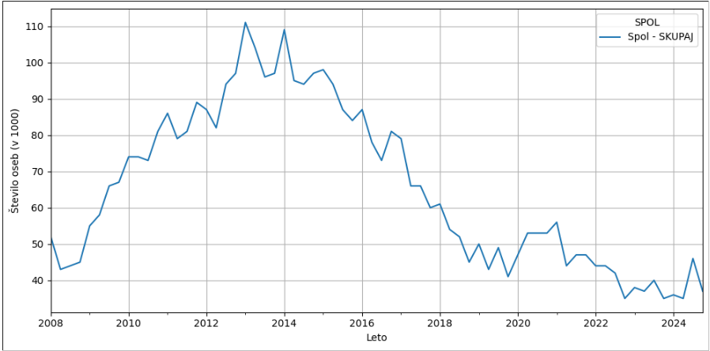
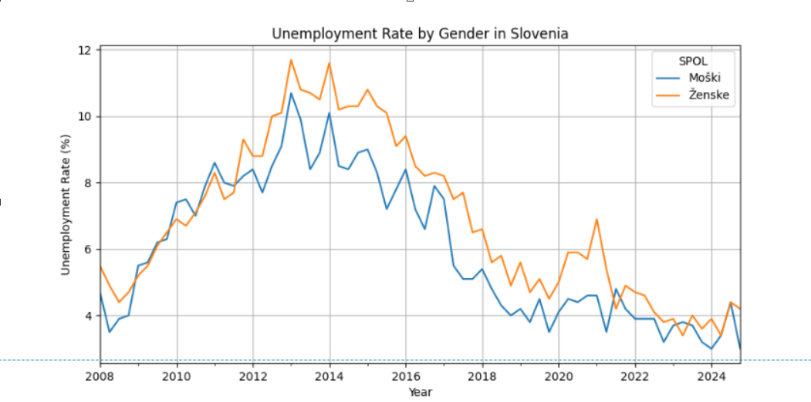
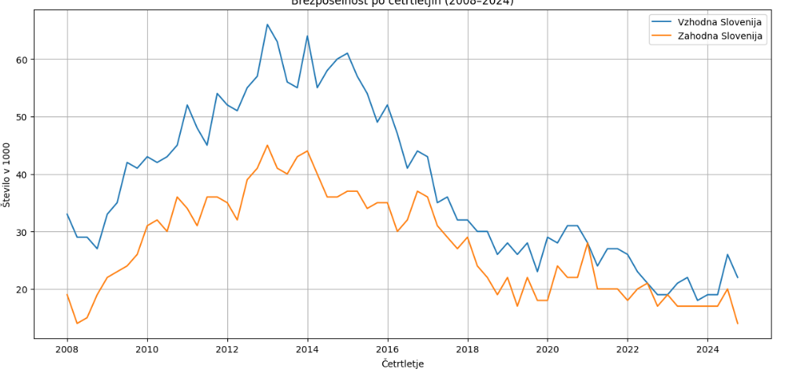
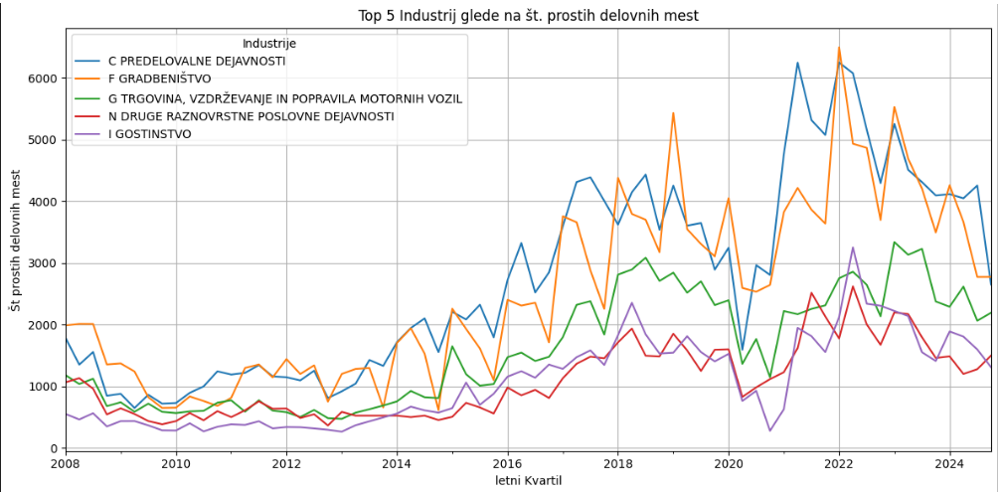

## Brezposelnost in Prosta Delovna Mesta v Sloveniji (2008-2024)

### 1. Opis problema
Raziskava se osredotoča na analizo ključnih trendov na trgu dela v Sloveniji v obdobju 2008–2024, pri čemer podrobno preučuje vpliv dveh večjih gospodarskih kriz: globalne finančne krize (2008–2013) ter pandemije COVID-19 (2020–2022). Obe obdobji sta pomembno zaznamovali gibanje brezposelnosti in razpoložljivost delovnih mest, kar se odraža v strukturnih spremembah na trgu dela, dolgotrajnem okrevanju in spreminjanju povpraševanja po delovni sili. 
Glavni cilji so bili:
1. Analizirati razlike v brezposelnosti
    -med spoloma, kjer nas zanima, kako so gospodarske krize različno vplivale na ženske in moške skozi celotno obdobje
    -med regijama (vzhodna in zahodna Slovenija), s poudarkom na trajnih regionalnih razlikah in njihovih vzrokih
2. Proučiti povezavo med brezposelnostjo in razpoložljivostjo delovnih mest

### 2. Podatki
4. Podatkovna osnova vključuje četrtletne podatke Statističnega urada RS (OPSI), podatki so v formatu pcaxis, kjer imamo besedilne in statistične tipe podatkov, predvsem:
1. brezposelneCetrtletno.PX :  
    • Ključne spremenljivke: regija, spol, število brezposelnih (v 1000) in delež v %, četrtletje.
2. delovnaMestaCetrtletno.PX : 
    • Ključne spremenljivke: število prostih/zasedenih mest po SKD dejavnostih.
3. Analizirati napovedovanje stopnje brezposelnosti na podlagi preteklih podatkov
4. 
  celotna koda je napisana v [Jupyter Notebook](https://github.com/KekecD/PR255/blob/main/projekt.ipynb)
### 3. Splošni trendi brezposelnosti (Slika 1)
Podatki kažejo dve kritični obdobji:
1. Finančna kriza (2008-2013)
    • vrhunec brezposelnosti v letih 2013-2014 (11.1% v letu 2013, 10.8% za 2014)
    • Počasno okrevanje do leta 2019
2. Pandemija COVID-19 (2020-2022)
    • Manjši šok kot leta 2008 (5.6% maksimalna brezposelnost v 2021)
    • Hitrejše okrevanje do leta 2024

### 4. Razlike med spoloma (Slika 2)
Ženske so bile ne-sorazmerno prizadete: 
    • Med krizo 2008: ženske imajo v 2013Q1 11.7%, moški pa 10.7% (1% razlike) 
    • Po letu 2020: v letu 2021Q1 ženske so imele 6.9% medtem moški 4.6% (2.3% razlike)

    
### 5. Regionalne razlike (Slika 3)
Vzhodna Slovenija kaže trajno slabše rezultate:
- V kriznih obdobjih največja razlika med vzhodom in zahodom je 3.1% leta 2013 (vzhodna 12.6%, zahodna 9.5%)
- Glavni vzroki: 
    • Manj industrije 
    • Manj investicij 

### 6. Prosta delovna mesta po dejavnosti (Slika 4)
Top 5 sektorjev z največ prostih mest:
1. Predelovalne dejavnosti
2. Gradbeništvo
3. Trgovina, vzdrževanje in popravila motornih vozil
4. Druge raznovrstne poslovne dejavnosti
5. Gostinstvo

Posebej zanimivi vzorci:
- Dejavnosti, ki imajo največ prostih mest so gradbeništvo in predelovanje dejavnosti.
- Gradbeništvo ima izrazito volatilnost. Opažamo periodične skoke in padce, kar je verjetno posledica začasne zaposlitve, sezonskih vplivov in odvisnost od gospodarskih ciklov.
- Gostinstvo ima tudi visok skok v letu 2022 do 2023, po odpravi COVID-19 ukrepov

### 7. Zaključki
Glavni vzorci kažejo:
1. Močno povezanost med gospodarskimi šoki in brezposelnostjo
2. Trajne regionalne neenakosti
3. Sektorske posebnosti
